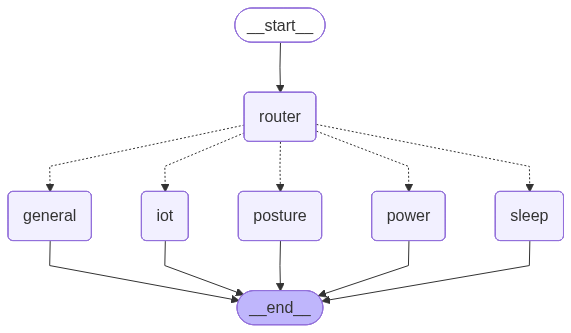

# Agent Architecture

이 문서는 현재 구현된 구조를 기준으로 한다. 공개 라우트의 중심은 router + 도메인별 ReAct tool loop, 그리고 분석 job이다.

## Runtime Shape

```text
FastAPI
  |
  +-- /chat/v1/turns
  |     |
  |     +-- app.graph.chat_runtime
  |           |
  |           +-- app.graph.turn_graph (router)
  |                 |
  |                 +-- app.graph.domain_router (intent classifier)
  |                 +-- app.graph.chat_subgraphs (sleep/power/posture/iot/general)
  |                       |
  |                       +-- app.graph.tool_loop
  |                             |
  |                             +-- app.graph.domain_tools (도메인별 query_db/rag_search 스코프)
  |                             +-- query_db / rag_search / devices / routine tasks
  |
  +-- /reports/v1/{domain}/{period}
  |     |
  |     +-- app.graph.report_turn_graph
  |
  +-- /sleep/v1/*, /power/v1/*
  |     |
  |     +-- app.services.jobs
  |     +-- app.services.sleep_analysis / power_analysis
  |     +-- app.services.embeddings
  |
  +-- /llm/v1/*
        |
        +-- app.clients.ollama
```

## Chat Graph

채팅 한 turn은 두 단계로 처리된다.

1. **router** 노드(`app/graph/domain_router.py`)가 LLM structured-output 호출로 마지막 사용자 메시지를 `sleep`/`power`/`posture`/`iot`/`general` 중 하나로 분류해 `state["domain"]`에 채운다. LLM이 없거나 실패하면 `general`로 fallback한다.
2. `state["domain"]`에 해당하는 **도메인 subgraph**(`app/graph/chat_subgraphs.py`)로 라우팅된다. 각 subgraph는 동일한 2노드 ReAct 루프(`app/graph/tool_loop.py`의 `build_tool_loop`)를 돌지만, 그 도메인에 스코프된 tool 목록과 시스템 프롬프트만 갖는다(`app/graph/domain_tools.py`). `general`은 예전처럼 전체 tool을 다 쓸 수 있는 fallback이다.

이 구조는 하나의 general agent가 모든 tool을 쥐고 매 턴 고르던 이전 단일 ReAct 루프를, "도메인 지정 → 그 도메인 tool만 노출된 subgraph 실행"으로 바꾼 것이다. `query_db`/`rag_search`는 tool 자체를 도메인마다 새로 만들지 않고, `make_query_db_tool(user_id, allowed_tables=...)` / `make_rag_search_tool(allowed_collections=...)`처럼 같은 tool 함수에 allowlist만 주입해서 재사용한다(`app/graph/tools.py`).

### Top-level dispatch

`router` -> 도메인별 subgraph -> `END`. `docs/graphs/turn_graph.png`는 `scripts/render_graphs.py`가 `app/graph/turn_graph.build_chat_graph()`를 실제로 컴파일해서 뽑은 그래프다.



### 도메인 subgraph 내부 (모든 도메인 공통 구조)

`build_tool_loop`이 만드는 각 subgraph는 tool 목록/시스템 프롬프트만 다르고 노드 구조는 동일한 2노드 ReAct 루프다. 아래는 `sleep` subgraph를 렌더링한 것으로, 다른 도메인도 노드 구조는 동일하다.


### 도메인별 tool 스코프

| domain | query_db table allowlist | rag_search collection allowlist | 그 외 tool |
|---|---|---|---|
| sleep | `sleep_session`, `sleep_stat`, `sleep_report` | `sleep_report`, `sleep_stat` | - |
| power | `power_energy`, `power_report` | `power_report` | - |
| posture | `gesture_set`, `gesture_log` | (없음) | - |
| iot | `routine_task`, `device` | (없음) | `list_devices`, `control_device`, `get_routine_tasks`, `update_routine_task` |
| general | 전체 테이블 (allowlist 없음) | 전체 컬렉션 (allowlist 없음) | 위 6개 tool 전부 |

allowlist를 벗어난 `table`을 모델이 호출하면 `query_db`가 진짜 DB에 나가지 않고 `db_query.py`와 동일한 `INVALID_FILTER` 에러 shape을 즉시 반환한다(`app/graph/tools.py`). `rag_search`는 allowlist 밖 collection을 조용히 드롭한다.

진입점:

- `app/routers/chat.py`
- `app/graph/chat_runtime.py`
- `app/graph/turn_graph.py` — router 노드 + 도메인별 subgraph 조립 (`build_chat_graph(user_id)`)
- `app/graph/domain_router.py` — intent 분류
- `app/graph/domain_tools.py` — 도메인별 tool 스코프(query_db table allowlist, rag_search collection allowlist)
- `app/graph/chat_subgraphs.py` — 도메인별 시스템 프롬프트 + `build_tool_loop` 조립
- `app/graph/tool_loop.py`

State (`app/state/chat_state.py`):

- `messages`
- `user_id`
- `chat_history_id`
- `now`
- `retrieved`
- `model`
- `rounds`
- `domain` — router가 채우는 현재 turn의 도메인

SSE는 LangGraph event stream을 `tool.start`, `tool.end`, `message.delta`, `message.completed`로 변환한다. `stream:false`는 같은 그래프를 동기 실행하고 최종 content와 tool call 요약을 반환한다.

## Report Graph

`/reports/v1/{domain}/{period}`는 앱 화면 표시용 구조화 리포트를 만든다. 백엔드가 계산한 `metrics`와 선택적 `raw`를 입력으로 받아 `summary`, `highlights`, `recommendations`를 반환한다.

진입점:

- `app/routers/reports_turn.py`
- `app/graph/report_turn_graph.py`
- `app/state/report_turn_state.py`

LLM 호출이 실패해도 rule-based fallback으로 응답할 수 있도록 설계되어 있다.

## Sleep/Power Analysis Jobs

`/sleep/v1/*`와 `/power/v1/*`는 앱 화면용 즉시 리포트가 아니라 DB/RAG 적재용 텍스트를 만든다.

```text
POST request
  |
  v
validate input
  |
  v
JobStore.create()
  |
  v
202 { jobId, status: queued }
  |
  v
background task
  |
  +-- invoke_text() with rule-based fallback
  +-- generate_embedding() when embed=true
  +-- JobStore.complete() or fail()
```

Job state는 `app/services/jobs.py`의 in-memory dict에만 저장된다. 완료/실패 후 24시간 보관되며 서버 재시작 시 유실된다.

## LLM Clients

- `app/services/llm.py`: Gemini 호출 래퍼. 채팅과 report/job 텍스트 생성에서 사용한다.
- `app/clients/ollama.py`: Ollama/OpenAI 호환 API transport. `/llm/v1/*` 프록시와 임베딩 job에서 사용한다.

## Legacy Domain Agents

다음 파일들은 현재 공개 라우트에 연결되어 있지 않다.

- `app/agents/sleep_agent.py`
- `app/agents/posture_agent.py`
- `app/agents/observation_agent.py`
- `app/agents/lifestyle_agent.py`
- `app/tools/sleep_api.py`
- `app/tools/posture_api.py`
- `app/tools/observation_api.py`
- `app/tools/schedule_api.py`

`sleep_agent`/`posture_agent`/`observation_agent`/`lifestyle_agent`와 이들이 쓰는 mock tool·프롬프트는 향후 ReAct 루프용 "도메인 insight tool"로 활용될 경우를 대비하여 코드는 남겨져 있다.

향후 백엔드 자세/관측/생활 패턴 스키마가 준비되면, 이 코드를 직접 라우트에 다시 붙이기보다 ReAct loop의 domain insight tool로 승격하는 편이 현재 구조와 잘 맞는다.
